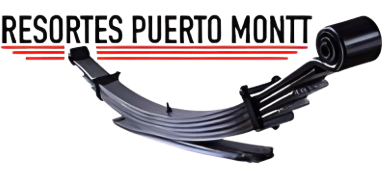

# 🔧 Sistema de Gestión - Taller Mecánico Resortes Puerto Montt



## 📋 Descripción del Sistema

Sistema integral de gestión empresarial diseñado específicamente para talleres mecánicos. Permite administrar clientes, inventario, cotizaciones, ventas y todos los aspectos operativos del negocio de manera eficiente y profesional.

## ✨ Características Principales

### 🏢 **Gestión Empresarial Completa**
- **Dashboard**: Panel de control con estadísticas en tiempo real
- **Clientes**: Administración completa de base de datos de clientes
- **Inventario**: Control de stock, productos y repuestos
- **Cotizaciones**: Sistema de cotizaciones y ventas profesional
- **Reportes**: Generación de reportes y análisis

### 🎨 **Interfaz Moderna y Profesional**
- **Diseño 2025**: Estética moderna con colores institucionales
- **Logo Corporativo**: Branding con logo Resortes Puerto Montt
- **UI/UX Optimizada**: Interfaz intuitiva y fácil de usar
- **Responsive**: Adaptable a diferentes tamaños de pantalla

### 🔧 **Funcionalidades Avanzadas**
- **Búsqueda Inteligente**: Sistema de búsqueda en todos los módulos
- **Cálculos Automáticos**: Cálculo automático de costos y precios
- **Gestión de Repuestos**: Selección y gestión de repuestos para cotizaciones
- **Impresión Profesional**: Generación de PDFs para cotizaciones
- **Comunicación**: Envío por email y WhatsApp integrado

### 📊 **Sistema de Cotizaciones Avanzado**
- **Formulario Inteligente**: Creación de cotizaciones con búsqueda de repuestos
- **Precios Ocultos**: Los precios de repuestos no se muestran al cliente
- **Precio Final**: Solo se muestra el precio final acordado
- **Múltiples Formatos**: Impresión, email y WhatsApp
- **Validaciones**: Sistema de validación completo

## 🚀 Tecnologías Utilizadas

- **Python 3.8+**: Lenguaje de programación principal
- **Tkinter**: Interfaz gráfica de usuario
- **SQLite3**: Base de datos integrada
- **ReportLab**: Generación de PDFs
- **Pandas**: Manejo de datos y Excel
- **Pillow (PIL)**: Procesamiento de imágenes

## 📦 Instalación

### Requisitos del Sistema
- **Sistema Operativo**: Windows 10/11, macOS, Linux
- **RAM**: 8GB recomendados (mínimo 4GB)
- **Espacio en Disco**: 1GB disponible
- **Resolución**: Mínimo 1024x768
- **Conexión a Internet**: Para envío de emails y WhatsApp

### Instalación Paso a Paso

1. **Clonar el Repositorio**
   ```bash
   git clone https://github.com/MathiasAlejandr0/ResortesPuertoMontt.git
   cd ResortesPuertoMontt
   ```

2. **Instalar Dependencias**
   ```bash
   pip install -r requirements.txt
   ```

3. **Ejecutar el Sistema**
   ```bash
   python main.py
   ```

## 🔑 Acceso al Sistema

### Usuario Administrador
- **Usuario**: `xxxx`
- **Contraseña**: `xxxx`
- **Rol**: Administrador completo

## 📱 Módulos del Sistema

### 👥 **Gestión de Clientes**
- Registro y edición de clientes
- Información de contacto completa
- Historial de vehículos
- Búsqueda y filtrado avanzado
- Estadísticas de clientes

### 📦 **Gestión de Inventario**
- Control de stock en tiempo real
- Productos y repuestos
- Categorías y proveedores
- Alertas de stock bajo
- Importación/Exportación Excel
- Análisis de inventario

### 💰 **Ventas y Cotizaciones**
- Creación de cotizaciones profesionales
- Búsqueda y selección de repuestos
- Cálculo automático de costos
- Precios ocultos para clientes
- Impresión de PDFs
- Envío por email y WhatsApp
- Conversión a ventas


### 📊 **Reportes y Análisis**
- Reportes de ventas
- Análisis de inventario
- Estadísticas de clientes
- Reportes financieros
- Exportación de datos

## 🔧 Configuración Avanzada

### Base de Datos
- **Tipo**: SQLite3 optimizada
- **Índices**: Optimización automática
- **Caché**: Sistema de caché inteligente
- **Respaldos**: Respaldos automáticos

### Rendimiento
- **Carga Asíncrona**: Carga de datos en segundo plano
- **Gestión de Memoria**: Optimización automática
- **Caché de Datos**: Almacenamiento temporal inteligente
- **Logging**: Sistema de logs avanzado

### Seguridad
- **Autenticación**: Sistema de login seguro
- **Roles de Usuario**: Control de acceso por roles
- **Encriptación**: Contraseñas encriptadas
- **Respaldos**: Sistema automático de respaldos

## 📞 Soporte y Contacto

### Información de Contacto
- **Empresa**: Resortes Puerto Montt
- **Email**: info@resortesptomontt.com
- **Teléfono**: +56 9 1234 5678
- **Ubicación**: Puerto Montt, Chile

### Soporte Técnico
- **Documentación**: Incluida en el sistema
- **Logs**: Sistema de logging integrado
- **Respaldos**: Automáticos y manuales
- **Actualizaciones**: Sistema de actualización

## 📄 Licencia

Este proyecto está desarrollado específicamente para Resortes Puerto Montt. Todos los derechos reservados.

## 🚀 Características Técnicas

### Arquitectura
- **Modular**: Diseño modular y escalable
- **Optimizada**: Rendimiento optimizado
- **Mantenible**: Código limpio y documentado
- **Extensible**: Fácil de extender y modificar

### Base de Datos
- **SQLite3**: Base de datos integrada
- **Índices**: Optimización de consultas
- **Migraciones**: Sistema de migraciones automáticas
- **Respaldos**: Respaldos automáticos programados

### Interfaz de Usuario
- **Tkinter**: Interfaz nativa multiplataforma
- **Responsive**: Adaptable a diferentes pantallas
- **Accesible**: Diseño accesible y fácil de usar
- **Profesional**: Estética empresarial moderna

## 🔄 Actualizaciones y Mantenimiento

### Versión Actual
- **v1.0.0**: Versión inicial completa
- **Fecha**: septiembre 2025
- **Estado**: Estable y funcional


---

**Desarrollado por Mathias Jara Alvarado FullStack Developer para Resortes Puerto Montt**

*Sistema de gestión empresarial profesional para talleres mecánicos*
